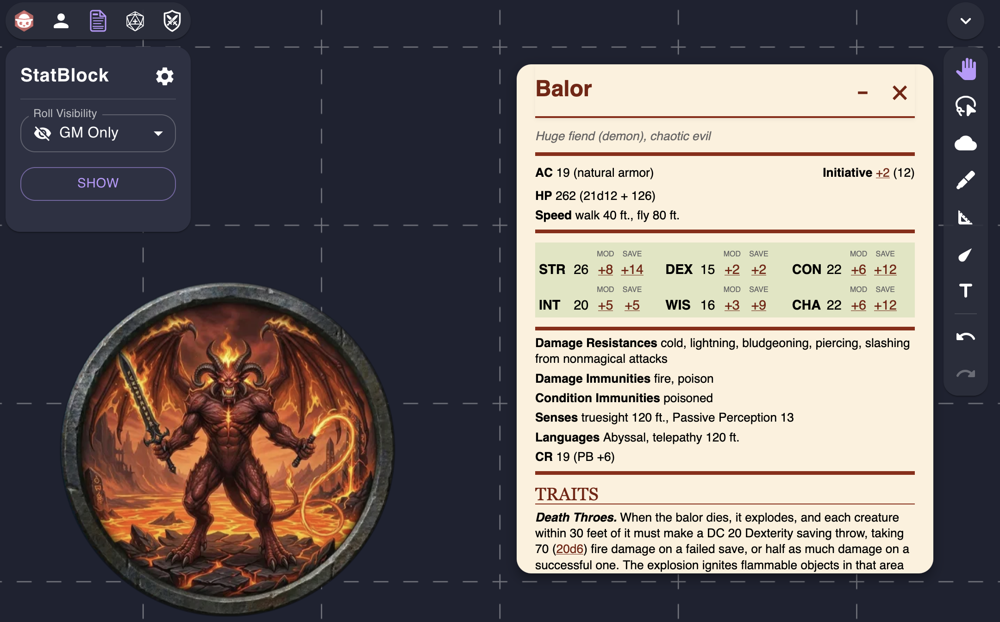

# Owlbear Statblock

Owlbear Statblock is an extension for [Owlbear Rodeo](https://www.owlbear.rodeo)
that brings 5th Edition Dungeons & Dragons stat blocks directly to your virtual
tabletop. It comes pre-loaded with the full bestiary from the **System Reference
Document 5.2 (SRD 5.2)** and automatically detects monsters by the name on their
token, attaching an interactive stat block that the Game Master can view and
roll from during encounters.

## Features

- **Automatic Detection**: When a GM adds a character token to the map, the
  extension checks its name against the bestiary. If a match is found, the stat
  block is securely attached to the token's metadata.
- **Interactive Rolls**: Click on ability checks, saving throws, attack bonuses,
  or damage dice within the stat block to roll them instantly.
- **Roll Visibility**: Toggle between public and private rolls. Choosing "GM
  Only" ensures only you can see the 3D dice and results in the Dice+ tray.
- **Custom Packs**: Need homebrew monsters or specific module adversaries? GMs
  can upload their own `.json` bestiary packs to expand the available roster.
- **Private to GMs**: To prevent metagaming, stat blocks and the ability to
  upload custom packs are strictly restricted to Game Masters.

## How to Use (For GMs)

1. **Install the Extension**: Add the Owlbear Statblock extension to your
   Owlbear Rodeo room.
2. **Add a Token**: Drag and drop a character token onto the map.
   - **Tip**: If you name your image file after the monster (e.g.,
     `Goblin.png`), Owlbear Rodeo will often use that as the token name
     automatically, speeding up the detection process.
3. **Name the Token**: Give the token the name of a standard 5e monster (e.g.,
   `Goblin`, `Adult Red Dragon`, `Acolyte`). The extension ignores case.
4. **Configure Roll Visibility**: In the main extension panel, use the **Roll
   Visibility** drop-down to choose between "Everyone" and "GM Only".
5. **Open the Stat Block Window**: Click the **Show** button in the extension's
   main panel to open the stat block viewer.
6. **View the Stat Block**: Select a token. If a match was found, its
   interactive stat block will appear in the window.
7. **Manage Custom Packs**: Click the Settings gear icon in the main extension
   panel to upload your own `.json` files containing custom monsters.

## Integrations

Owlbear Statblock is designed to work seamlessly with other popular extensions
to enhance your VTT experience.

### Dice+

If you have the **Dice+** extension installed, any rolls you click in a stat
block (such as an attack roll of `+5` or damage of `1d6 + 2`) will be sent
directly to the 3D dice tray, allowing everyone at the table to see the physical
dice roll.

- **Advantage/Disadvantage**: Hold **Shift** while clicking a roll to roll with
  Advantage, or **Cmd/Ctrl** to roll with Disadvantage.

### Battle-board

Statblock integrates cleanly alongside **Battle-board**. While Battle-board
manages the initiative order and combat flow, you can keep your target's stat
block open right next to it, giving you a complete command center for running
your encounters.

- **Shortcut**: Double-clicking a monster's name within the Battle-board list
  will automatically open its stat block in this extension.

## Creating Custom Packs

If you want to add your own monsters, check out the
[Custom Pack Formatting Guide](./docs/FORMAT.md) to learn how to structure your
JSON files.

## Contributing

If you're a developer interested in improving the extension or seeing how it
works under the hood, check out the [Contributing Guide](./CONTRIBUTING.md).

## Legal

This work includes material from the System Reference Document 5.2.1 (“SRD
5.2.1”) by Wizards of the Coast LLC, available at
<https://www.dndbeyond.com/srd>. The SRD 5.2.1 is licensed under the Creative
Commons Attribution 4.0 International License, available at
<https://creativecommons.org/licenses/by/4.0/legalcode>.
