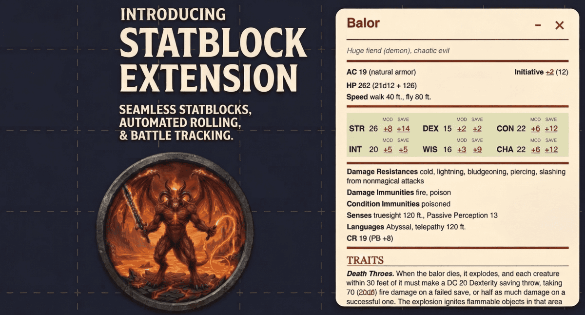
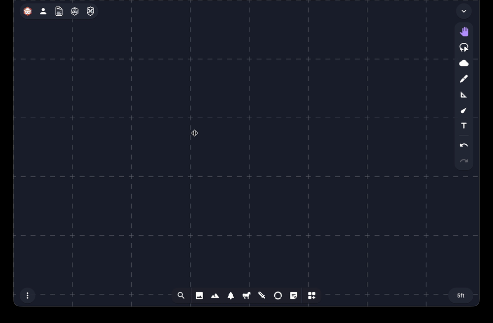
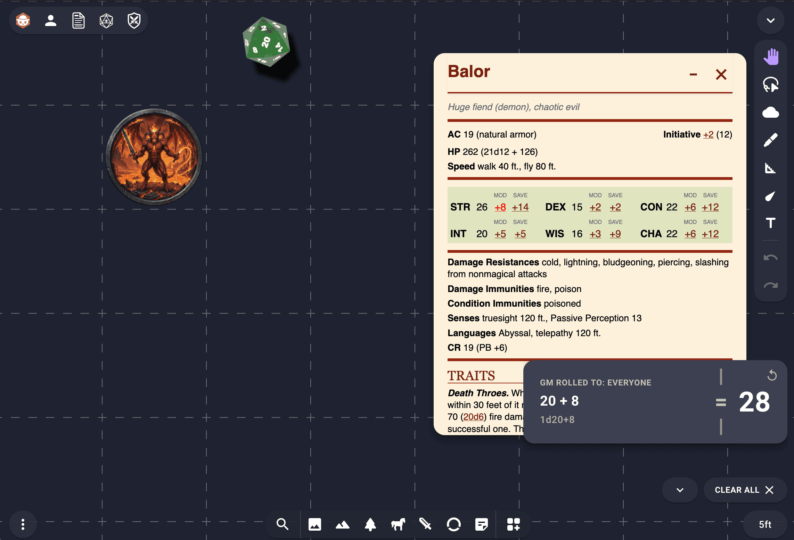
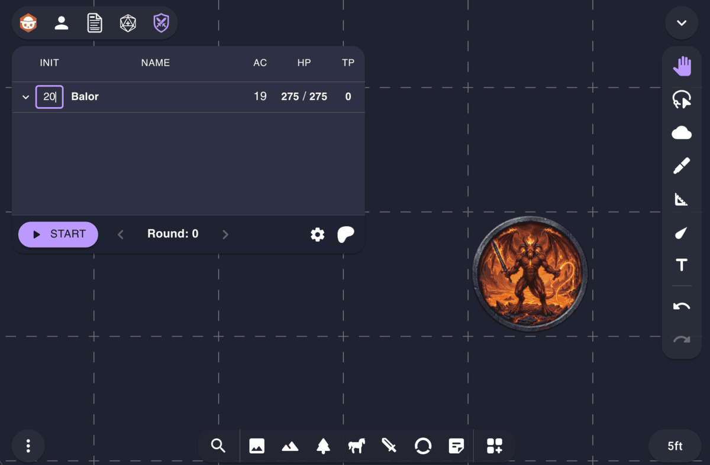

# Owlbear Statblock

Owlbear Statblock is an extension for [Owlbear Rodeo](https://www.owlbear.rodeo)
that brings 5th Edition Dungeons & Dragons stat blocks directly to your virtual
tabletop. It comes pre-loaded with the full bestiary from the **System Reference
Document 5.2 (SRD 5.2)** and automatically detects monsters by the name on their
token, attaching an interactive stat block that the Game Master can view and
roll from during encounters.

## Features

- **Automatic Detection**: When a GM adds a character token to the map, the
  extension checks its name against the bestiary. If a match is found, the stat
  block is securely attached to the token's metadata.
- **Included Bestiary**: Built-in support for over 330 monsters from the
  [SRD 5.2](https://www.dndbeyond.com/srd) (see the
  [complete list](./docs/MONSTERS.md)).
- **Interactive Rolls**: Click on ability checks, saving throws, attack bonuses,
  or damage dice within the stat block to roll them instantly.
- **Roll Visibility**: Toggle between public and private rolls. Choosing "GM
  Only" ensures only you can see the 3D dice and results in the Dice+ tray.
- **Custom Packs**: Need homebrew monsters or specific module adversaries? GMs
  can upload their own `.json` bestiary packs to expand the available roster.
- **Private to GMs**: To prevent metagaming, stat blocks and the ability to
  upload custom packs are strictly restricted to Game Masters.

## How to Use (For GMs)



1. **Install the Extension**: Add the Owlbear Statblock extension to your
   Owlbear Rodeo room using the manifest URL:
   ```text
   https://statblock.juzam.pro/manifest.json
   ```
2. **Add a Token**: Drag and drop a character token onto the map.
   - **Tip**: If you name your image file after the monster (e.g.,
     `Goblin.png`), Owlbear Rodeo will often use that as the token name
     automatically, speeding up the detection process.
3. **Name the Token**: Give the token the name of a standard 5e monster (e.g.,
   `Goblin`, `Adult Red Dragon`, `Acolyte`). The extension ignores case.
4. **Open the Stat Block Window**: Click the **Show** button in the extension's
   main panel to open the stat block viewer.
5. **View the Stat Block**: Select a token. If a match was found, its
   interactive stat block will appear in the window.

### Download Monster Tokens

To help you get started, a pre-made pack of tokens for all 330 monsters in the
SRD is provided. These tokens are already named to match the extension's
detection system.

- **[Download Token Pack (ZIP)](https://statblock.juzam.pro/data/token-pack.zip)**

### Managing Custom Packs

You can expand your bestiary beyond the built-in SRD by uploading your own
monster packs.

> [!IMPORTANT]
> **Backup your files!** Custom packs are stored directly in your web browser.
> This means they are not shared between different computers or browsers. It is
> highly recommended to keep a backup of your monster pack files in a safe
> place, such as Google Drive or Dropbox, so they can be easily restored if
> browser history is cleared or a new device is used.

1. **Prepare your JSON**: Your custom monsters must follow a specific data
   format. Refer to the [Custom Pack Formatting Guide](./docs/FORMAT.md) for
   schema details and interactive tag support.
2. **Access the Manager**: Click the **Settings (gear icon)** in the extension
   panel to open the Custom Packs manager.
3. **Upload and Validate**: Click **Upload** to select your `.json` file.
   - The extension performs **automatic validation** during upload. If your file
     contains errors (e.g. a missing Armor Class or malformed dice notation), a
     descriptive error message will pinpoint exactly which monster and field
     need fixing.
4. **Browse and Delete**: Uploaded packs are stored locally in your browser. You
   can expand a pack to see its monster list or click the **Delete (trash
   icon)** to remove it.

## Integrations

Owlbear Statblock is designed to work seamlessly with other popular extensions
to enhance your VTT experience.

### Dice+

If you have the [**Dice+**](https://extensions.owlbear.rodeo/dice-plus)
extension installed, any rolls you click in a stat block (such as an attack roll
of `+5` or damage of `1d6 + 2`) will be sent directly to the 3D dice tray,
allowing everyone at the table to see the physical dice roll.

- **Advantage/Disadvantage**: Hold **Shift** while clicking a roll to roll with
  Advantage, or **Cmd/Ctrl** to roll with Disadvantage.

- **Configure Roll Visibility**: In the main extension panel, use the **Roll
  Visibility** drop-down to choose between "Everyone" and "GM Only".



### Battle-board

Statblock integrates cleanly alongside
[**Battle-board**](https://extensions.owlbear.rodeo/battle-board). While
Battle-board manages the initiative order and combat flow, you can keep your
target's stat block open right next to it, giving you a complete command center
for running your encounters.

- **Shortcut**: Double-clicking a monster's name within the Battle-board list
  will automatically open its stat block in this extension.



## Contributing

If you're a developer interested in improving the extension or seeing how it
works under the hood, check out the [Contributing Guide](./CONTRIBUTING.md).

## Legal

This work includes material from the System Reference Document 5.2.1 (“SRD
5.2.1”) by Wizards of the Coast LLC, available at
<https://www.dndbeyond.com/srd>. The SRD 5.2.1 is licensed under the Creative
Commons Attribution 4.0 International License, available at
<https://creativecommons.org/licenses/by/4.0/legalcode>.

## License

The source code in this repository is licensed under the MIT License. See the
[LICENSE](./LICENSE) file for details.

**Assets** The AI-generated tokens located in the [docs/tokens](./docs/tokens)
directory are dedicated to the public domain under CC0 1.0 Universal. See
[LICENSE-CC0.txt](./docs/tokens/LICENSE-CC0.txt) for details.
